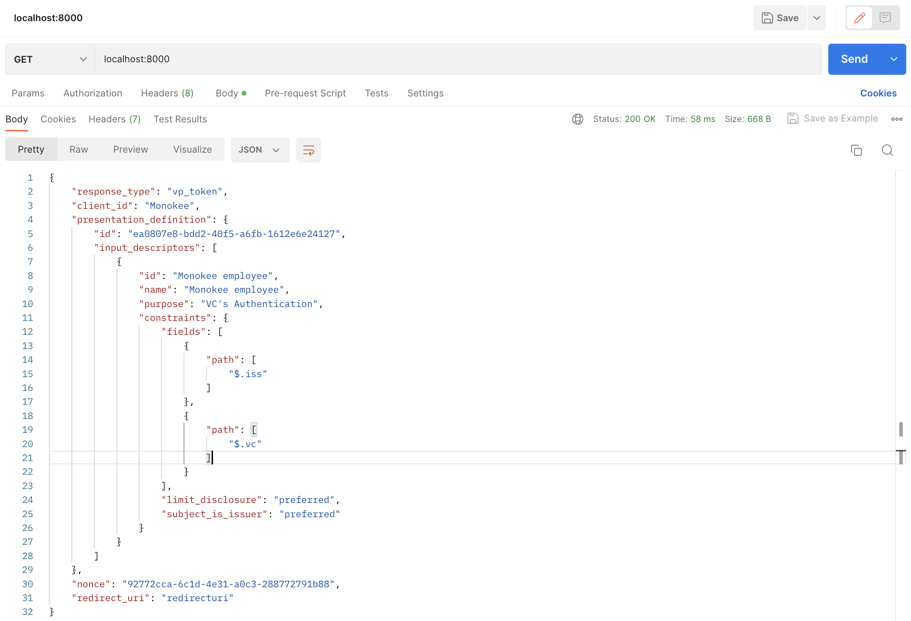
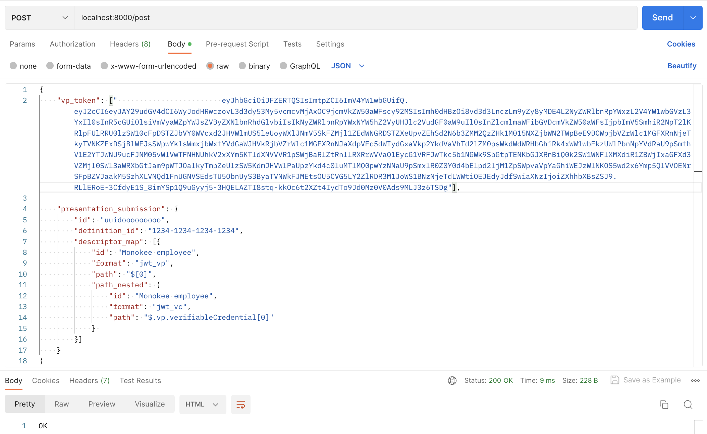

# OIDC4VP

This project simulates the *Same Device Flow* of *OIDC4VP* by creating a server with two different endpoints:

- **request**: used to retrieve a well-made AuthorizationRequest

- **response**: used to validate an AuthorizationResponse

 

# Commands:

* run the server:    

    >$ nodemon server.ts

* generate an invalid jwt (for testing purposes)
  
    >$ ts-node ./lib/test/jwt_creator.ts